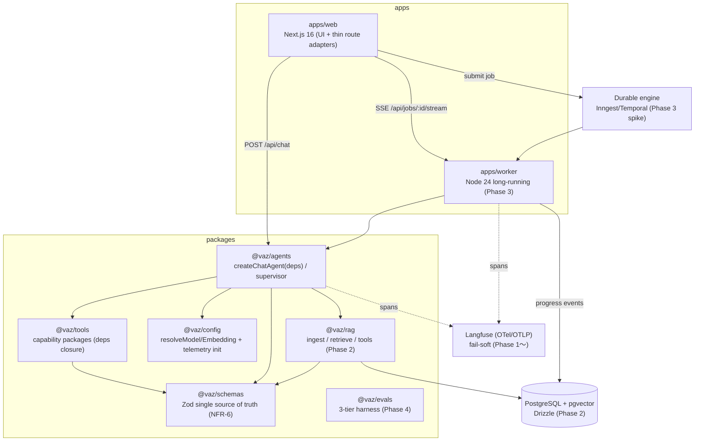
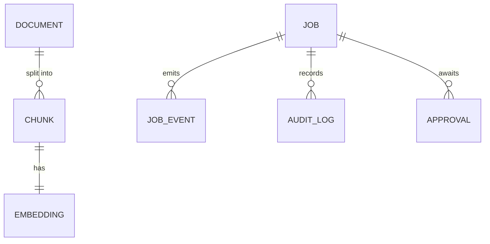

# 001-vaz-ai-update — Technical Plan

承認済み要件（WHAT）を設計（HOW）へ翻訳する。実装コードは含まない。
`rules/plan-principles.md` および `research.md` / `gap-analysis.md` に準拠する。
散文は日本語、識別子・型・コードは英語（`spec.json` `language: ja`）。

## Summary

既存の良質な資産（env 駆動プロバイダ / Zod 境界 / 品質ゲート）を保存したまま、
**段階的モノレポ（Hybrid）** へ移行する（ADR-1）。中核は AI SDK 7 の一次プリミティブ
（`ToolLoopAgent` / `toolApproval` / `@ai-sdk/otel` / `embedMany` / `MockLanguageModelV4`）
を **薄くラップ**し、車輪の再発明を避けること。唯一の本質的課題である「耐久性」は
**AI SDK=型付き合成＋承認契約 / 外部エンジン=耐久実行・中断再開** の責務分割で解く
（ADR-2、エンジンは Phase 3 スパイクで確定）。Phase 1〜5 は要件 1〜5 に 1:1 対応し、
各 Phase は独立検証可能・後方互換（NFR-5）。

## Architecture Overview

主要な流れ:
- **チャット（Phase 1）**: `apps/web` の薄い route が `@vaz/agents#createChatAgent(deps)`
  を呼び、その stream を `toUIMessageStream`→`createUIMessageStreamResponse` に通して既存と
  同一形状の UI message stream を返す（回帰なし R1.7）。オーケストレーションは route に置かない（R1.5）。
- **RAG（Phase 2）**: `@vaz/rag` の retrieve capability を agent のツールとして供給し、
  `RetrievedChunk`/`Citation` 契約で引用を返す（R2.4）。
- **ワークフロー（Phase 3）**: `apps/web` はジョブ投入のみ、実行は `apps/worker` +
  外部エンジン。進捗は DB/Redis 経由で SSE 配信（R3.6）。破壊的ツールは `toolApproval`
  で中断し、エンジンが再開を担保（R3.4/3.5/3.7/3.8）。
- **可観測性（Phase 1〜）**: 全 agent 呼び出しに OTel span、Langfuse へ export（fail-soft）。

## Components

### @vaz/schemas （契約の単一正本 / NFR-6）

- **Responsibility**: 全境界の Zod スキーマと推論型を一元管理する（env / chat request /
  tool I/O / RAG 契約 / workflow handoff / eval 契約 / event union）。
- **Public interface**: `aiEnvSchema` + `parseAiEnv`（拡張: `AI_EMBEDDING_PROVIDER`,
  `LANGFUSE_*`, engine 設定）; `chatRequestSchema`; `type AgentDeps`（`db`/`logger`/`now` +
  `audit` sink 契約: who/job/tool/args を記録, R5.5）; `AuditEntrySchema`（Phase 5）;
  `RetrievedChunkSchema` / `CitationSchema`（Phase 2）; `workflows.ts` の各 step I/O
  と `JobEventSchema`（判別共用体, Phase 3）; `GradeReportSchema`（Phase 4）。
- **Owns**: すべての境界スキーマ定義とその推論型。
- **Does NOT own**: ランタイム実装（プロバイダ解決・DB アクセス・エージェント実行）。
  React/Carbon/Node ランタイムに依存しない。
- **Requirements**: 1.3, 1.4(型), 2.3(env), 2.4, 3.3, 3.6(event), 4.5, NFR-3, NFR-6

### @vaz/config （env 駆動解決 + 可観測性初期化）

- **Responsibility**: env からモデル/埋め込みモデルを解決し、OTel/Langfuse を fail-soft で
  初期化する。共有 base tsconfig を提供する。
- **Public interface**: `resolveModel(env?)`（既存移設）; `resolveEmbeddingModel(env?)`
  （既定 Ollama `nomic-embed-text`, R2.3）; `initTelemetry()`（`@ai-sdk/otel`
  `registerTelemetry`, Langfuse OTLP は env 有時のみ, R4.1/4.3）; `tsconfig.base.json`。
- **Owns**: プロバイダ/埋め込み解決ロジック、テレメトリ初期化、モデル ID 許可リスト
  （R1.8 の唯一の合法直書き箇所）。
- **Does NOT own**: スキーマ定義（`@vaz/schemas` を参照）、エージェント実行、UI。
- **Requirements**: 1.8, 2.3, 4.1, 4.2, 4.3, NFR-3, NFR-4, NFR-7

### @vaz/tools （capability パッケージ）

- **Responsibility**: `tool({ description, inputSchema, execute })` を capability 単位で
  束ねて 1 export し、`execute` は deps を closure から読む。
- **Public interface**: `createTimeCapability(deps)` → `{ getCurrentTime }`（既存 demo 移設）;
  破壊的ツールは `needsApproval`/`contextSchema` を宣言し、外部送信ツールは宛先許可リストを
  適用（R5.4, Phase 5）。
- **Owns**: ツール定義とその入力スキーマ参照、deps closure 化、承認宣言。
- **Does NOT own**: エージェントループ、承認**判定ポリシー**（agents 側 `toolApproval`）、
  スキーマ本体（schemas）。
- **Requirements**: 1.4, 3.4, 5.4

### @vaz/agents （エージェントコア）

- **Responsibility**: `ToolLoopAgent` を薄くラップした `createChatAgent(deps)` を提供し、
  Phase 3 では supervisor による専門エージェントへの型付きディスパッチを構成する。
- **Public interface**: `createChatAgent(deps: AgentDeps)` → agent（`stream`/`generate`）;
  `AgentDeps`（`db`/`logger`/`now`, `@vaz/schemas`）; request scope は `runtimeContext`
  + tool `toolsContext`/`contextSchema`（ADR-3）; `toolApproval` ポリシー（RAG 駆動時に
  破壊的ツールを無効化/HITL 化, R5.3）; `createSupervisorWorkflow(deps)`（Phase 3, R3.3）。
- **UI stream ブリッジ（R1.7 回帰なしの要）**: `createChatAgent(deps).stream()` は
  AI SDK 7 の agent stream を返し、route 側で **`toUIMessageStream` → `createUIMessageStreamResponse`**
  に通して既存と同一形状の UI message stream 応答を生成する（`useChat` 互換, Constitution P3）。
  移行はまず現行 `streamText` 呼び出しを `createChatAgent` 内へ**挙動等価で封じ込め**、
  回帰 E2E（`chat-ollama.spec.ts` 等）が緑になった後に `ToolLoopAgent` 化を進める
  （ブリッジ点は同梱 docs `node_modules/ai/docs/` で確認, ADR-1/R1.7）。
- **Owns**: エージェント構成、deps 注入規約、stop 条件（`isStepCount`）、承認判定ポリシー、
  **ツール実行監査の発火点**（agent ループの lifecycle で全ツール呼び出しを `deps.audit` へ記録 →
  web・worker 双方の経路を単一箇所で網羅, R5.5）。
- **Does NOT own**: HTTP 層（web）、ツール実装（tools）、耐久実行/中断再開（engine/worker）、
  検索（rag）、監査ログの**永続化実装**（deps に注入される sink; web/worker が DB 実装を供給）。
- **Requirements**: 1.3, 1.4, 1.6, 1.7, 3.3, 5.1(scope), 5.3, 5.5(発火点)

### @vaz/rag （検索基盤 / Phase 2）

- **Responsibility**: `ingest/`（loader→chunk→embed→upsert）と `retrieve/`（ベクトル検索）を
  実装し、retrieval を capability として export する。
- **Public interface**: `ingest(corpusPath, deps)`（CLI: `pnpm --filter @vaz/rag ingest ./docs`,
  R2.6）; `createRetrievalCapability(deps)` → 検索ツール（`RetrievedChunk`/`Citation` を返す,
  R2.4）; Drizzle schema（`drizzle-zod`, R2.2）。埋め込みは `@vaz/config#resolveEmbeddingModel`
  経由 `embedMany`（R2.3）。reranker なしで機能（R2.7）。
- **Owns**: chunking 戦略、ベクトル upsert/検索、pgvector インデックス（HNSW/IVFFlat）、
  埋め込み次元の初期確定（DDL 固定 N）と upsert 時の provider/dim 整合ガード（R2.2/2.3）。
- **Does NOT own**: DB プロビジョニング（docker-compose）、埋め込みプロバイダ解決（config）、
  引用の提示 UI（web）、LLM 呼び出し。
- **Requirements**: 2.1, 2.2, 2.3, 2.4, 2.5, 2.6, 2.7, 5.2(区切り注入)

### apps/web （UI + 薄い HTTP アダプタ）

- **Responsibility**: Next.js アプリ。チャット UI と、agents/engine への薄い委譲のみを行う
  route を持つ。可観測性を `instrumentation.ts` で起動する。
- **Public interface**: `POST /api/chat`（Zod 検証→`@vaz/agents`, R1.5）;
  `POST /api/jobs`（ジョブ投入→engine, R3.2）; `GET /api/jobs/:id/stream`（SSE, R3.6）;
  `POST /api/jobs/:id/approve`（承認イベント, R3.4/3.5）; `Chat.tsx`（既存）;
  `useJobStream`（SSE 消費, R3.6）; 承認 UI（approve/reject/edit, R3.4）;
  `instrumentation.ts`（OTel 登録, R4.1）; `auth`（OIDC, Phase 5, R5.1）。
- **Owns**: HTTP ルーティング、リクエスト検証、UI コンポーネント、SSE エンドポイント、
  認証セッション（Phase 5）。
- **Does NOT own**: エージェント/ワークフローのオーケストレーション、耐久実行、検索実装。
- **Requirements**: 1.5, 1.7, 3.4, 3.6, 4.1, 5.1

### apps/worker （長時間実行ワーカー / Phase 3）

- **Responsibility**: Node 24 常駐プロセスとして耐久ワークフローを実行し、`@vaz/agents` /
  `@vaz/rag` を import する。コンテナ化する。
- **Public interface**: エンジンのワーカーエントリ（step 実行）; 進捗イベントを DB/Redis へ
  永続化（R3.6）; Dockerfile + docker-compose サービス（R3.1）。
- **Owns**: ジョブ実行、チェックポイント、進捗イベント発行、worker 経路の `deps.audit` DB sink
  実装の供給（発火点は `@vaz/agents`; web 経路も同一契約で記録, R5.5）。
- **Does NOT own**: HTTP/UI（web）、契約定義（schemas）、エンジン内部実装。
- **Requirements**: 3.1, 3.2, 3.5, 3.6, 3.7, 3.8, 4.2, 5.5

### Durable workflow engine （外部耐久エンジン / Phase 3・ADR-2）

- **Responsibility**: 制御フローの耐久実行、チェックポイント、承認待ち中断→再開、再起動跨ぎ完走。
- **Public interface**: ジョブ投入 API（web から）、step 定義（worker）、承認シグナル。
  具体 API は Phase 3 冒頭スパイク（Inngest vs Temporal TS SDK）で確定（Q2）。
- **Owns**: 耐久性・中断/再開・リトライ・スケジューリング。
- **Does NOT own**: エージェント推論、型付きハンドオフ契約（schemas）、UI。
- **Requirements**: 3.2, 3.5, 3.7, 3.8

### @vaz/evals （評価ハーネス / Phase 4）

- **Responsibility**: 3 層評価（unit(MockModel) / RAG recall@k / LLM-as-judge）を実装し、
  結果を Langfuse へ記録する。
- **Public interface**: tier1 Vitest unit（ツール選択・ループ制御・スキーマ適合）;
  tier2 `recall@k`（埋め込みのみ, R2.5 と共有）; tier3 `eval:nightly`（実モデル + judge,
  evalite/promptfoo, コスト上限, R4.4/4.6）; judge は `GradeReport`（outcome/behavior 分離,
  R4.5）を生成。
- **Owns**: golden set 実行、採点契約の適用、nightly ゲート。
- **Does NOT own**: 契約定義（schemas）、CI ワークフロー YAML（apps/web ルート外の CI 設定）。
- **Requirements**: 4.4, 4.5, 4.6

### Workspace toolchain （品質ゲートのワークスペース化 / 横断・NFR-1）

- **Responsibility**: 単一パッケージ前提の tsconfig/Vitest/Playwright/git hooks/supply-chain を
  ワークスペース対応へ改修し、緑を維持する。
- **Public interface**: `pnpm-workspace.yaml`（`apps/*`/`packages/*` + supply-chain 維持）;
  root `tsconfig`（project references）/ Vitest projects（web=jsdom, node=agents/rag）;
  Playwright webServer（`--filter @vaz/web`）; `.githooks/*`（`pnpm -r`/mise）;
  `mise.toml`（`-r`/`--filter` タスク）; `forbid-model-ids` grep ゲート（R1.8/ADR-5）。
- **Owns**: モノレポのツール設定とゲート配線。
- **Does NOT own**: 各パッケージの機能実装。
- **Requirements**: 1.1, 1.2, 1.8, 1.9, 1.10, NFR-1, NFR-2

## Data Model

Phase 2〜3 で導入する永続エンティティ（PostgreSQL + pgvector, Drizzle）。Phase 1 は無状態。

| Entity | Field | Type | Notes |
|--------|-------|------|-------|
| Document | id / source / metadata / ingestedAt | uuid / text / jsonb / timestamptz | Phase 2, ingest 単位（R2.1） |
| Chunk | id / documentId / ordinal / content | uuid / uuid(fk) / int / text | R2.1 chunking |
| Embedding | chunkId / vector / dim / provider | uuid(fk) / vector(N) / int / text | pgvector。`vector(N)` は DDL 時に**次元固定**（env で動的変更不可）。既定 Ollama `nomic-embed-text`=768 を初期 N とし、プロバイダ変更は migration + 全 re-ingest 必須。`provider`/`dim` 列で混在を検出（R2.2/2.3） |
| Job | id / userId / status / workflow / createdAt | uuid / text / enum / text / timestamptz | Phase 3（R3.2） |
| JobEvent | id / jobId / type / payload / ts | uuid / uuid(fk) / enum / jsonb / timestamptz | 判別共用体（R3.6） |
| Approval | id / jobId / toolCallId / state / args | uuid / uuid(fk) / text / enum / jsonb | HITL 中断（R3.4/3.5） |
| AuditLog | id / jobId / userId / tool / args / ts | uuid / uuid(fk,nullable) / text / text / jsonb / timestamptz | 全ツール実行記録。発火点は `@vaz/agents` の deps.audit、jobId は同期チャット経路では null 可（R5.5） |

## Interfaces / Contracts

- `POST /api/chat` — body: `chatRequestSchema`（既存）; res: UI message stream。route は
  `createChatAgent(deps).stream()` を `toUIMessageStream` →
  `createUIMessageStreamResponse` に通すだけの薄いアダプタ（既存応答形状を保持, R1.5/1.7）。
- `POST /api/jobs` — body: workflow 種別 + 入力（`@vaz/schemas/workflows.ts`）; res: `{ jobId }`（R3.2）。
- `GET /api/jobs/:id/stream` — SSE; event: `JobEvent`（判別共用体: step-start/tool-call/token/
  completion/error）（R3.6）。
- `POST /api/jobs/:id/approve` — body: `{ toolCallId, decision: approve|reject, args? }`;
  効果: 中断中ワークフローの再開（R3.4/3.5）。
- CLI: `pnpm --filter @vaz/rag ingest <path>` — コーパスを end-to-end 取り込み（R2.6）。
- 型付きハンドオフ: 各 workflow step の I/O は `packages/schemas/workflows.ts` の Zod で固定
  （supervisor→specialist、NFR-6/R3.3）。
- Agent deps: `AgentDeps = { db, logger, now }`（closure）+ request scope（`runtimeContext`:
  `{ userId, role }`, tool `contextSchema`: 権限/機密）（ADR-3）。

## File Structure Plan

MANDATORY。作成/変更する全ファイルと 1 文責務。ここに無いパスは tasks.md の `_Boundary:_`
対象にできない。**Phase 列**が段階分離（R1.10）を担保する。既存 `src/**` は Phase 1 で
`apps/web/src/**` へ移設（move）する。

### Phase 1 — モノレポ化 + Agent 層（R1 / NFR-1,2,3,5,6,7）

| File | Create/Modify | Phase | Responsibility |
|------|---------------|-------|----------------|
| `pnpm-workspace.yaml` | Modify | 1 | `apps/*`/`packages/*` を追加し supply-chain 設定を維持（R1.1/1.2） |
| `mise.toml` | Modify | 1 | `pnpm -r`/`--filter` 対応タスク + `lint:model-ids` を追加（R1.9/1.8） |
| `tsconfig.json` | Modify | 1 | root を project references のソリューションへ変更（NFR-1） |
| `.githooks/pre-commit` | Modify | 1 | bare `pnpm exec` を `pnpm -r`/mise 経由へ（R1.9） |
| `.githooks/pre-push` | Modify | 1 | E2E を `--filter @vaz/web` 経由へ（R1.9） |
| `packages/config/package.json` | Create | 1 | `@vaz/config` パッケージ定義 |
| `packages/config/tsconfig.base.json` | Create | 1 | 全パッケージ共有の base tsconfig（React Compiler 非適用境界） |
| `packages/config/src/provider.ts` | Create | 1 | `resolveModel` を移設（env 駆動, R1.8/NFR-3） |
| `packages/config/src/model-allowlist.ts` | Create | 1 | 合法なモデル ID 既定値の唯一の集約点（R1.8） |
| `packages/config/src/telemetry.ts` | Create | 1 | `initTelemetry()`（`@ai-sdk/otel`, Langfuse fail-soft, R4.1/4.3/NFR-7） |
| `packages/schemas/package.json` | Create | 1 | `@vaz/schemas` パッケージ定義 |
| `packages/schemas/src/env.ts` | Create | 1 | `aiEnvSchema`/`parseAiEnv` を移設（NFR-3） |
| `packages/schemas/src/chat.ts` | Create | 1 | `chatRequestSchema` を移設（NFR-6） |
| `packages/schemas/src/deps.ts` | Create | 1 | `AgentDeps` 型（`db`/`logger`/`now` + optional `audit` no-op sink）と logger 契約（R1.3/4.7） |
| `packages/tools/package.json` | Create | 1 | `@vaz/tools` パッケージ定義 |
| `packages/tools/src/time.ts` | Create | 1 | `createTimeCapability(deps)`（demo ツールを deps closure 化, R1.4） |
| `packages/tools/src/index.ts` | Create | 1 | capability の集約 export |
| `packages/agents/package.json` | Create | 1 | `@vaz/agents` パッケージ定義 |
| `packages/agents/src/chat-agent.ts` | Create | 1 | `createChatAgent(deps)`（`ToolLoopAgent` ラップ, R1.3/1.7） |
| `packages/agents/src/index.ts` | Create | 1 | エージェント公開 API |
| `packages/agents/tests/chat-agent.spec.ts` | Create | 1 | `MockLanguageModelV4` + mock deps 単体テスト（R1.6, no network） |
| `apps/web/package.json` | Create | 1 | `@vaz/web` パッケージ定義（`@vaz/*` 依存） |
| `apps/web/tsconfig.json` | Create | 1 | Next 管理設定 + base 継承 + `@ → src` alias |
| `apps/web/next.config.ts` | Modify(move) | 1 | 既存を移設; React Compiler は web のみ |
| `apps/web/src/app/api/chat/route.ts` | Modify(move) | 1 | 薄い HTTP⇔Agent アダプタへ縮退（R1.5） |
| `apps/web/src/app/{layout,page}.tsx` | Modify(move) | 1 | 既存を移設 |
| `apps/web/src/features/chat/*` | Modify(move) | 1 | 既存 UI を移設（R1.7 挙動等価） |
| `apps/web/src/assets/styles/global.scss` | Modify(move) | 1 | 既存を移設 |
| `apps/web/instrumentation.ts` | Create | 1 | `registerOTel` + `registerTelemetry`（OTel を Phase 1 から, NFR-7/R4.1） |
| `apps/web/vitest.config.ts` | Create | 1 | web(jsdom) プロジェクト設定 |
| `vitest.config.ts` | Modify | 1 | Vitest projects（web=jsdom / node パッケージ=node）へ（NFR-1） |
| `playwright.config.ts` | Modify | 1 | webServer を `--filter @vaz/web` へ（R1.7/1.9） |
| `apps/web/tests/e2e/*` | Modify(move) | 1 | 既存 E2E を移設（回帰なし, R1.7） |
| `scripts/forbid-model-ids.sh` | Create | 1 | モデル ID 直書き検出 grep ゲート（R1.8/ADR-5） |

### Phase 2 — RAG 層（R2 / 5.2）

| File | Create/Modify | Phase | Responsibility |
|------|---------------|-------|----------------|
| `docker-compose.yml` | Create | 2 | postgres+pgvector 開発プロビジョニング（R2.2） |
| `packages/rag/package.json` | Create | 2 | `@vaz/rag` パッケージ定義 |
| `packages/rag/src/db/schema.ts` | Create | 2 | Drizzle スキーマ（document/chunk/embedding, `drizzle-zod`, R2.2） |
| `packages/rag/src/ingest/index.ts` | Create | 2 | loader→chunk→embed→upsert（R2.1/2.6） |
| `packages/rag/src/retrieve/index.ts` | Create | 2 | ベクトル検索（reranker なし, R2.7） |
| `packages/rag/src/tools.ts` | Create | 2 | retrieval capability（`RetrievedChunk`/`Citation`, R2.4） |
| `packages/agents/src/chat-agent.ts` | Modify | 2 | RAG retrieval capability をツール登録し引用付き回答（R2.4, deps 駆動で後方互換） |
| `packages/rag/bin/ingest.ts` | Create | 2 | `pnpm --filter @vaz/rag ingest` エントリ（R2.6） |
| `packages/config/src/embedding.ts` | Create | 2 | `resolveEmbeddingModel`（既定 Ollama, R2.3） |
| `packages/schemas/src/env.ts` | Modify | 2 | `AI_EMBEDDING_PROVIDER` 等を追加（R2.3） |
| `packages/schemas/src/rag.ts` | Create | 2 | `RetrievedChunk`/`Citation` 契約（R2.4/NFR-6） |
| `packages/rag/tests/recall.spec.ts` | Create | 2 | golden set `recall@k`（埋め込みのみ, CI, R2.5） |
| `packages/rag/tests/fixtures/golden-set.json` | Create | 2 | 20–50 件の質問→期待 docID（R2.5） |
| `pnpm-workspace.yaml` | Modify | 2 | `pg` 等の install script を `allowBuilds` へ監査追記（R1.2） |

### Phase 3 — ワーカー + ワークフロー + HITL（R3 / 5.5）

| File | Create/Modify | Phase | Responsibility |
|------|---------------|-------|----------------|
| `docs/spikes/phase3-durable-engine.md` | Create | 3 | Inngest vs Temporal スパイク結論（Q2/ADR-2） |
| `packages/schemas/src/workflows.ts` | Create | 3 | supervisor→specialist step I/O + `JobEvent` 判別共用体（R3.3/3.6） |
| `packages/agents/src/supervisor.ts` | Create | 3 | supervisor 計画→専門エージェント分配（R3.3） |
| `packages/agents/src/approval-policy.ts` | Create | 3 | `toolApproval` ポリシー（破壊的=`user-approval`, R3.4/5.3） |
| `packages/tools/src/email.ts` | Create | 3 | 代表的破壊的ツール（外部送信、`needsApproval` 宣言、承認フロー実証, R3.4） |
| `apps/worker/package.json` | Create | 3 | `@vaz/worker` パッケージ定義（Node 24 常駐） |
| `apps/worker/src/main.ts` | Create | 3 | エンジンワーカーエントリ; step 実行（R3.1/3.2） |
| `apps/worker/src/events.ts` | Create | 3 | 進捗イベント永続化（DB/Redis, R3.6） |
| `apps/worker/src/audit.ts` | Create | 3 | worker 経路の `deps.audit` DB sink 実装（発火点は `@vaz/agents`, R5.5） |
| `apps/worker/Dockerfile` | Create | 3 | worker コンテナ化（`pnpm deploy`, R3.1） |
| `docker-compose.yml` | Modify | 3 | worker + engine + redis サービス追加（R3.1） |
| `apps/web/src/app/api/jobs/route.ts` | Create | 3 | ジョブ投入（実行と分離, R3.2） |
| `apps/web/src/app/api/jobs/[id]/stream/route.ts` | Create | 3 | SSE Route Handler（R3.6） |
| `apps/web/src/app/api/jobs/[id]/approve/route.ts` | Create | 3 | 承認イベント受信→再開シグナル（R3.4/3.5） |
| `apps/web/src/features/jobs/useJobStream.ts` | Create | 3 | SSE 消費フック（R3.6） |
| `apps/web/src/features/jobs/ApprovalPanel.tsx` | Create | 3 | 承認 UI（approve/reject/edit args, R3.4） |
| `apps/web/tests/e2e/approval-resume.spec.ts` | Create | 3 | 翌日承認→再開 E2E（R3.8） |

### Phase 4 — 可観測性 + 評価（R4; OTel は Phase 1 済）

| File | Create/Modify | Phase | Responsibility |
|------|---------------|-------|----------------|
| `packages/config/src/telemetry.ts` | Modify | 4 | span 属性 `jobId`/`userId`/agent を付与（R4.2、`userId` 実値は Phase 5 認証 18.2 後） |
| `packages/schemas/src/eval.ts` | Create | 4 | `GradeReport`（outcome/behavior 分離, R4.5） |
| `packages/evals/package.json` | Create | 4 | `@vaz/evals` パッケージ定義 |
| `packages/evals/src/unit/*.spec.ts` | Create | 4 | tier1: MockModel でツール選択/ループ/スキーマ適合（R4.4） |
| `packages/evals/src/judge.ts` | Create | 4 | tier3: LLM-as-judge（evalite/promptfoo, R4.4/4.5） |
| `packages/evals/src/nightly.ts` | Create | 4 | nightly 実行 + コスト上限（R4.6） |
| `.github/workflows/eval-nightly.yml` | Create | 4 | `eval:nightly`（Secrets ゲート, コスト上限, 退行検知, R4.6） |
| `packages/schemas/src/deps.ts` | Modify | 4 | logger 契約に PII 非記録（INFO 既定 off）を明文化（R4.7） |

### Phase 5 — セキュリティ（R5）

| File | Create/Modify | Phase | Responsibility |
|------|---------------|-------|----------------|
| `docs/spikes/phase5-idp.md` | Create | 5 | IdP 連携方式確定（Auth.js/社内標準, R5.1/Q5） |
| `apps/web/src/lib/auth.ts` | Create | 5 | OIDC 認証; セッション→`runtimeContext` 権限（R5.1） |
| `packages/agents/src/prompt.ts` | Create | 5 | RAG 結果を区切りコンテキストとして注入（system 非混合, R5.2） |
| `packages/agents/src/approval-policy.ts` | Modify | 5 | 外部読取駆動時に破壊的ツール無効/HITL（lethal trifecta, R5.3） |
| `packages/tools/src/allowlist.ts` | Create | 5 | 外部送信ツールの宛先許可リスト（R5.4） |
| `packages/agents/src/audit-hook.ts` | Create | 5 | agent lifecycle で全ツール実行を `deps.audit` へ発火（web/worker 共通発火点, R5.5） |
| `apps/web/src/lib/audit.ts` | Create | 5 | web 経路の `deps.audit` DB sink 実装（R5.5） |
| `packages/schemas/src/deps.ts` | Modify | 5 | `AgentDeps.audit` sink 契約 + `AuditEntrySchema` を確定（Phase 1 は no-op 許容, R5.5） |

## Error Handling & Edge Cases

- Langfuse/OTel の env 未設定 → 起動継続、警告 1 回、API 応答へ伝播させない（fail-soft, R4.3/NFR-4）。
- DB/Ollama/engine 未設定 → 起動継続、該当 capability 呼出し時のみエラー（NFR-4）。
- 不正 JSON / Zod 検証失敗 → `Response.json({ error, issues }, { status: 400 })`（既存規約, Constitution P1）。
- モデル ID を `@vaz/config` 外に直書き → lint ステージ失敗（R1.8/ADR-5）。
- worker 再起動中のジョブ → エンジンのチェックポイントから完走（R3.7）。
- 承認待ち中に翌日承認 → チェックポイントから再開（R3.5/3.8）。
- RAG 結果に注入的テキスト → 区切りブロックで隔離、破壊的ツールは無効/HITL（R5.2/5.3）。
- 外部送信の宛先が許可リスト外 → ツール実行を拒否（R5.4）。
- 埋め込みプロバイダ変更で次元不一致（例 768→1536）→ `vector(N)` は DDL 固定のため、upsert 時に provider/dim を検証して拒否し、migration + 全 re-ingest を要求（R2.2/2.3）。
- Phase 1 に RAG/WF を混入 → File Structure Plan の Phase 列 + CI 範囲で拒否（R1.10）。

## Constitution Compliance

| Principle | Status | Notes |
|-----------|--------|-------|
| 1. Validate at Every Boundary | ✅ | 全境界を `@vaz/schemas` の Zod で固定（NFR-6）。既存 400 応答規約を保持。 |
| 2. Test-First Discipline | ✅ | 各機能は先行して失敗テスト（tier1 MockModel / recall@k / E2E）。`@vaz/agents` から適用。 |
| 3. Current-API Fidelity | ✅ | `ToolLoopAgent`/`toolApproval`/`@ai-sdk/otel`/`embedMany`/`MockLanguageModelV4` を同梱 docs で実地確認（`ai@7.0.14`）。 |
| 4. Provider-Agnostic & Local-First | ✅ | `resolveModel`/`resolveEmbeddingModel` は env 駆動、既定 Ollama ローカル・鍵不要（R2.3/1.8）。 |
| 5. Quality Gates Non-Negotiable | ✅ | ワークスペース化後も lint/typecheck/test を `pnpm -r`/mise で緑維持（NFR-1）。`import type` 継続。 |
| Server/Client boundary | ✅ | Carbon は `apps/web/src/features/*`（`"use client"`）; `page.tsx` は Server Component 維持。 |
| Supply chain | ✅ | `allowBuilds`（default deny）+ `minimumReleaseAge` を維持し新規ネイティブ依存を監査追記（R1.2）。 |
| Secrets | ✅ | 鍵はコード/コミット/文書に出さず env（`ANTHROPIC_API_KEY`/`LANGFUSE_*`）から供給。 |

CRITICAL 違反なし。全 MUST 原則充足。

## Requirements Traceability

| Requirement ID | Component(s) |
|----------------|--------------|
| 1.1 | Workspace toolchain |
| 1.2 | Workspace toolchain |
| 1.3 | @vaz/agents, @vaz/schemas |
| 1.4 | @vaz/tools, @vaz/schemas |
| 1.5 | apps/web, @vaz/agents |
| 1.6 | @vaz/agents (tests) |
| 1.7 | apps/web, @vaz/agents |
| 1.8 | @vaz/config, Workspace toolchain |
| 1.9 | Workspace toolchain |
| 1.10 | Workspace toolchain (File Structure Plan Phase 列) |
| 2.1 | @vaz/rag |
| 2.2 | @vaz/rag, docker-compose |
| 2.3 | @vaz/config, @vaz/schemas, @vaz/rag |
| 2.4 | @vaz/rag, @vaz/schemas, @vaz/agents (retrieval tool 登録) |
| 2.5 | @vaz/rag (recall@k), @vaz/evals |
| 2.6 | @vaz/rag (bin) |
| 2.7 | @vaz/rag |
| 3.1 | apps/worker |
| 3.2 | Durable engine, apps/web, apps/worker |
| 3.3 | @vaz/agents (supervisor), @vaz/schemas (workflows) |
| 3.4 | @vaz/tools, @vaz/agents (approval-policy), apps/web (ApprovalPanel) |
| 3.5 | Durable engine, apps/web (approve) |
| 3.6 | apps/web (SSE, useJobStream), apps/worker (events), @vaz/schemas (JobEvent) |
| 3.7 | Durable engine, apps/worker |
| 3.8 | Durable engine, apps/web (E2E) |
| 4.1 | @vaz/config (telemetry), apps/web (instrumentation) |
| 4.2 | @vaz/config, apps/worker |
| 4.3 | @vaz/config (fail-soft) |
| 4.4 | @vaz/evals |
| 4.5 | @vaz/evals, @vaz/schemas (GradeReport) |
| 4.6 | @vaz/evals, .github/workflows/eval-nightly.yml |
| 4.7 | @vaz/schemas (deps/logger), @vaz/config (recordInputs/Outputs) |
| 5.1 | apps/web (auth), @vaz/agents (deps scope) |
| 5.2 | @vaz/agents (prompt), @vaz/rag |
| 5.3 | @vaz/agents (approval-policy) |
| 5.4 | @vaz/tools (allowlist) |
| 5.5 | @vaz/agents (発火点), @vaz/schemas (audit 契約), apps/web + apps/worker (DB sink) |
| NFR-1 | Workspace toolchain |
| NFR-2 | Workspace toolchain, mise |
| NFR-3 | @vaz/config, @vaz/schemas |
| NFR-4 | @vaz/config (fail-soft) |
| NFR-5 | File Structure Plan (Phase 列), Workspace toolchain |
| NFR-6 | @vaz/schemas |
| NFR-7 | @vaz/config (telemetry), apps/web (instrumentation) |

---

_Plan generated: 2026-07-04_
_Revised: 2026-07-04 (validate-plan fixes — R1.7 UI-stream bridge / R5.5 audit as deps-injected cross-cutting sink / R2.3 pgvector fixed-dimension policy)_
